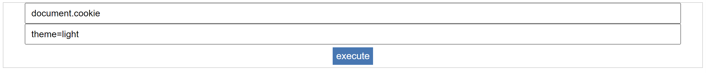

# ShellControl

A PowerApps [PCF](https://learn.microsoft.com/en-us/power-apps/developer/component-framework/overview) component that implement a naive JavaScript shell via the `eval` function.

Execute commands by typing them in the first input field and click "execute", then viewing their output in the second input field.



(*) Built to learn about PowerApps client-side runtime.

## How to use?

1. Import [the solution zip](bin/Solutions.zip) as Power Platform solution.
2. Use one of the following guides:
   1. Add to [model-driven app](https://learn.microsoft.com/en-us/power-apps/developer/component-framework/add-custom-controls-to-a-field-or-entity)
   2. Add to [canvas app](https://learn.microsoft.com/en-us/power-apps/developer/component-framework/component-framework-for-canvas-apps#add-components-to-a-canvas-app)
   3. Add to [portal app](https://learn.microsoft.com/en-us/powerapps/maker/portals/component-framework-tutorial)

## How to recreate?

Prerequisites:

- Windows machine
- [Power Platform CLI](https://learn.microsoft.com/en-us/power-platform/developer/cli/introduction#update-power-platform-cli-for-windows)
- npm
- [MSBuild](https://learn.microsoft.com/en-us/visualstudio/msbuild/msbuild?view=vs-2022)

### Run locally

Commands:

```bash
# scope to component dir
cd component
# install dependencies
npm install
# build local harness
npm run build
# run local harness
npm start
```

For more information, see [Microsoft Docs](https://learn.microsoft.com/en-us/power-apps/developer/component-framework/implementing-controls-using-typescript#build-your-code-components).

### Build and Package

Commands:

```powershell
# scope to component dir
mkdir component
cd component
# create new boilerplate component
pac pcf init --namespace <specify your namespace here> --name <Name of the code component> --template field --run-npm-install
# scope solution to Solutions dir
mkdir Solutions
cd Solutions
# create new boilerplate solution
pac solution init --publisher-name <Developer name> --publisher-prefix <Unique prefix, e.g. dev>
# reference component
pac solution add-reference --path ..\
# build solution
msbuild /t:build /restore
```

For more information, see [Microsoft Docs](https://learn.microsoft.com/en-us/power-apps/developer/component-framework/create-custom-controls-using-pcf).
